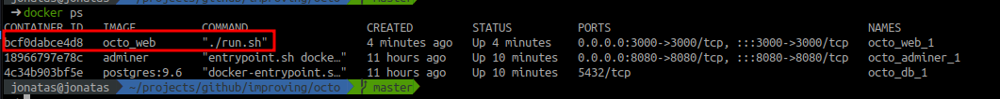
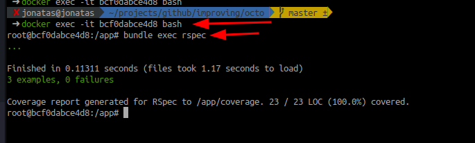
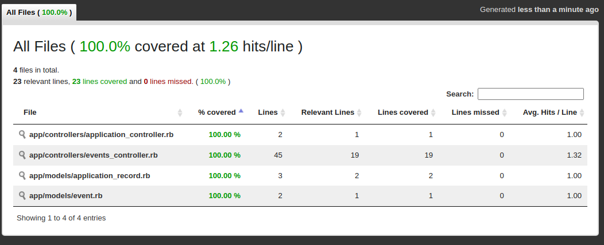

# Octo Event

Challenge description can be found here

[Challenge](docs/challenge.md)


## How to run the project

As can be seen in the gif, I used docker to implement all the development of the project.

The command needed to run will be this:

```bash
docker-compose up --build
```

already `ngrok` I put on port `3000`:

```bash
sudo ngrok http 3000
```

At the end of the curl command I added `jq` to make the command output more readable

```bash
curl -s 'http://localhost:3000/issues/{add issues number here}/events' | jq
```

## Unit Test

To run the tests, I accessed the container.

I find the ID of the container:
```bash
docker ps
```


Then run this command with the ID you got:

```bash 
docker exec -it ${add-ID-here} bash
```

inside the container run the command `bundle exec rspec`



This print counts the coverage that was achieved.

